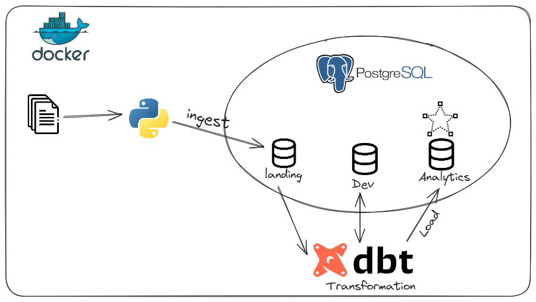
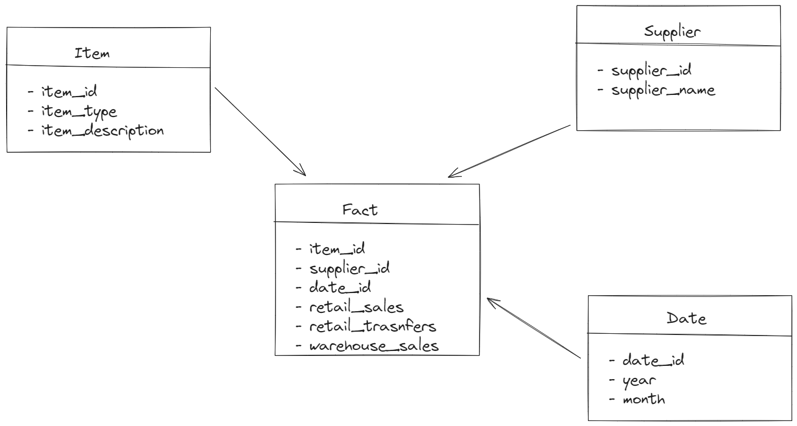

## Architecture 


## Tech Stack 
* DBT 
* Docker
* SQL
* Python 

## Project Overview 
The primary goal of this project is to create a data warehouse with a star schema on PostgreSQL based on a CSV file, facilitating analytics and dashboarding. We used Python to ingest raw data into the data warehouse on a specific schema and then utilized DBT to transform data, building all the dimension tables and the fact table (Dev schema). Subsequently, we applied tests to the resulting data before deploying it to our prod schema.

## Data model 



## Run the Project 
* Spin up the containers using:

```
make up
```

* Run the Ci and test 
```
make ci
```
 
* Ingest the CSV file data into PostgreSQL:

```
make ingest
```

* Run the DBT models (this will run into the dev schema):

```
make dbt-debug  #to check if the connection to postgres works
make dbt-deps #install packages
make dbt-run
make dbt-test
```

* Deploy all the models to the production schema:

```
make dbt-deploy
```

* To query the PostgreSQL database, run:

```
make warehouse
```

And then write some queries : 
* Best items in terms of retail sales:

```
SELECT 
    item_id, 
    ROUND(CAST(SUM(retail_sales) AS numeric),2) AS total_sales
FROM analytics.fact_sales
GROUP BY item_id
ORDER BY total_sales DESC 
LIMIT 10
```

or 

* Warehouse and retail sales by year and months 

```
SELECT 
    year,
    month,
    ROUND(CAST(SUM(warehouse_sales) AS numeric), 2) AS total_warehouse_sales,
    ROUND(CAST(SUM(retail_sales) AS numeric), 2) AS total_retail_sales
FROM analytics.fact_sales a
JOIN analytics.dim_date d ON a.date_id = d.date_id
GROUP BY year, month
ORDER BY year, month;
```


